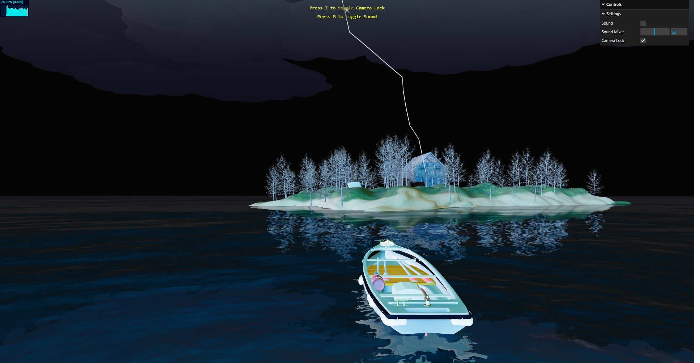

# Survivng Boat

A boat trying to survive the foggy thunder storm by going to the island created by ThreeJS

Check it out  [here!](https://mazen-ghaleb.github.io/Surviving-Boat/ "Project's Git Page Link")

## __Description__
For our project, we created a scene with a thunder and lightning storm on a sea. The scene contains a small island with trees and a wooden building. There is a boat in the water that can be controlled using keyboard to move around in the scene. It stops advancing when it reaches the island. You can orbit the scene using the mouse. We added controllers to enable and disable the storm sound effects along with a sound mixer to manipulate the volume. There is also a button to lock the camera onto the boat. We also included a VR for android mobile to the project. The boat has to survive in the storm!

### __Project includes :__
1. Realistic sea water
2. Foggy Weather
3. Clouds
4. Lightning strikes
5. Lightning in Clouds
6. Lighting (Ambient light, directional light, and point light )
7. Island
8. Interactive Boat
9. Sounds effect for Waves, Wind, and thunder
10. VR for android mobile
11. Controls
